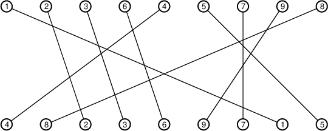

# Simple Graph Representations

The `SimpleGraphRepresentations` module is an extension of
`SimpleGraphs`. It provides methods for dealing with intersection
graphs and the like.
This module requires the `PyPlot`,
`SimpleGraphs`, `ClosedIntervals`, and
`Permutations` modules.

The functions in this module deal with the following types of graphs:

+ Interval graphs (and interval digraphs)
+ Permutation graphs
+ Cographs
+ Threshold graphs
+ Tolerance graphs
+ Geometric graphs
+ Circle graphs
+ Intersection graphs (of finite sets)

## Interval graphs

We provide the following functions for creating interval graphs and
interval digraphs.

### Interval graphs (standard)

+ `IntervalGraph(Jlist)` creates an interval graph from a list of
  closed intervals. The vertices are numbered `1` to `n` (where `n` is
  the length of `Jlist`).

+ `IntervalGraph(f)` where `f` is a dictionary mapping vertex names to
  closed intervals creates an interval graph.

+ `RandomIntervalGraph(n)` creates a random `n`-vertex interval graph.

### Unit interval graphs

+ `UnitIntervalGraph(x,t)` creates a unit interval graph in which the
  left end points of the intervals are given in the vector `x` and the
  lengths of the intervals is `t`.

+ `UnitIntervalGraph(f,t)` creates a unit interval graph from a dictionary
  `f` mapping vertex names to the left end points of the intervals.
  The optional parameter `t` gives the length of the intervals.

+ `RandomUnitIntervalGraph(n,t)` creates a random unit interval graph
  in which the left end points are `n` iid uniform values in [0,1] and
  `t` is the length of the intervals.

+ `UnitIntervalGraphEvolution(pts)` gives the sequence of edges add as
  the lengths of the intervals (whose left end points are given in
  `pts`) increases. This returns a pair consisting of the sequence of
  edges and the lengths at which those edges appear.

+ `UnitIntervalGraphEvolution(n::Int)` is equivalent to
  `UnitIntervalGraphEvolution(sort(rand(n)))`.


### Directed interval graphs

#### Type I

+ `IntervalDigraph1(Jlist)` creates a type I interval digraph from a
  list of intervals.

+ `IntervalDigraph(f)` where `f` is a dictionary mapping vertex names
  to closed intervals creates a type I interval digraph.

+ `RandomIntervalDigraph1(n)` creates a random type I interval digraph
  with `n` vertices.


#### Type II

+ `IntervalDigraph2(snd_list, rec_list)` creates a type II interval
  digraph from two lists of intervals.

+ `IntervalDigraph2(s,r)` creates a type II interval digraph where `s`
  and `r` are dictionaries mapping a set of vertices to closed
  intervals.

+ `RandomIntervalDigraph2(n)` creates an `n`-vertex random type II
  interval digraph.

## Permutation graphs

Create permutation graphs from one or two `Permutation` objects.

+ `PermutationGraph(p,q)` creates a permutation graph in which there
  is an edge from `u` to `v` iff `(p[u]-p[v])*(q[u]-q[v])<0`.

+ `PermutationGraph(p)` is equivalent to `PermutationGraph(p,id)`
  where `id` is the identity permutation.

+ `PermutationGraph(d)` where `d` is a `Dict` creates a permutation
  graph whose vertices are the keys in `d`. The values in `d` should
  be pairs of numbers. That is, `d`'s type should be
  `Dict{Vtype, Tuple{R1,R2}}` where `Vtype` is the type of the
  vertices and `R1` and `R2` are subtypes of `Real`.

+ `PermutationGraph(f,g)` where `f` and `g` are `Dict`s mapping
  a vertex set to real values.

+ `RandomPermutationGraph(n)` creates an `n`-vertex random permutation
  graph.

+ `PermutationRepresentation(G)` creates a pair of dictionaries
  from the vertex set of `G` to integers. These mappings are a
  permutation representation of `G`.

**Note**: We include an extra file in the `src` directory entitled
`PermutationRepresentationDrawing` that includes code for
visualizing permutation representations of graphs.
Sample output for one is shown here:



This code required `PyPlot`.


## Cographs

A *cograph* (also called a *complement reducible graph*) is
formed from single vertex graphs via the operations join
and disjoint union. We provide the following functions:

+ `RandomCograph(vlist)` creates a random cograph whose
vertices are the elements of `vlist`.
+ `RandomCograph(n)` creates a random cograph whose
vertices are `1:n`.
+ `is_cograph(G)` determines whether `G` is a cograph.


## Threshold graphs

+ `ThresholdGraph(wts)` creates a threshold graph from a list of
  weights. Vertices are named `1:n` where `n=length(wts)`.

+ `ThresholdGraph(f)` creates a threshold graph from a dictionary
  mapping vertex names to weights.

+ `RandomThresholdGraph(n)` creates a random threshold graph with
  vertices named `1:n` with IID uniform [0,1] weights.

+ `CreationSequence(G)` returns the creation sequence of a threshold
  graph (or raises an error if `G` is not threshold). This returns a
  pair `(seq,vtcs)` where `seq` is the creation sequence and `vtcs` is
  a listing of the vertices in the order in which they should be
  added.

+ `ThresholdRepresentation(G)` returns a threshold representation of
  `G` (or raises an error if `G` is not threshold). This returns a
  dictionary mapping the vertices of `G` to weights (of type
  `Rational`).


## Intersection graphs

+ `IntersectionGraph(setlist)` creates an intersection graph from a
  list of sets (all of type `Set` or all of type `IntSet`). Vertices
  are named `1:n` where `n` is the length of the list of sets.

+ `IntersectionGraph(f)` creates an intersection graph from a
  dictionary mapping vertex names to sets.

## Geometric graphs

A *geometric graph* is a graph whose vertices are represented by
points in a metric space (for our purposes, Euclidean space) in which
a pair of vertices forms an edge iff the distance between their points
is at most 1 (or some other specified value).

+ `GeometricGraph(A)` where `A` is an `m` by `n` matrix creates a
  geometric graph in which the columns of `A` are the points
  representing the vertices `1:n`. Two vertices are adjacent iff the
  distance between the points is at most 1 (or an optional second
  parameter, `d`).

+ `GeometricGraph(f)` where `f` is a `Dict` mapping vertex names to
  vectors creates a geometric graph in which two vertices are adjacent
  iff distance between their points is at most 1 (or `d` if given as a
  second argument).

+ `RandomGeometricGraph(n::Int, dim::Int=2, d::Real=1)` creates a
  random geometric graph by generating `n` points at random in the
  unit `dim`-cube.  Vertices are adjacent if their corresponding
  points are at distance at most `d`.

## Tolerance graphs

A *tolerance graph* is a graph whose vertices are represented by a
pair consisting of a closed interval and a real tolerance. Two
vertices are adjacent if the length of the intersection of their
intervals exceeds either tolerance.

+ `ToleranceGraph(Jlist, tlist)` creates a tolerance graph with vertex
  set `1:n` where `Jlist` is an `n`-long list of closed intervals and
  `tlist` is an `n`-long list of real tolerances.

+ `ToleranceGraph(f)` where `f` is a `Dict` creates a tolerance graph
  where `f` maps vertex names to pairs `(J,t)` where `J` is a closed
  interval and `t` is a real tolerance. For example:
  ```
  f = Dict{ASCIIString, Tuple{ClosedInterval{Int},Float64}}()
  f["alpha"] = ( ClosedInterval(3,6), 0.2 )
  ```

## Circle graphs

A *circle graph* is the intersection graph of the
chords of a circle. We provide the following:

+ `CircleGraph(list)` creates a circle graph where
`list` is a list of elements each of which appears
exactly twice. Here, list is typically an `Array` but
may also be an `ASCIIString`.

+ `RandomCircleGraph(n)` creates a random circle
graph with vertex set `1:n`.


This representation drawing was created with `CircleRepresentationDrawing`.
See also `RainbowDrawing`.

+ `CircleGraphRepresentation(G)` returns a circle graph representation of
the graph `G` (or throws an error if the graph is not a circle graph).
The current implementation works but is slow. New one is in the works.


## Acknowledgements

Thanks to Tara Abrishami for contributing these functions:

+ `CreationSequence`
+ `ThresholdRepresentation`
+ `PermutationRepresentation`
+ `CircleGraphRepresentation`
